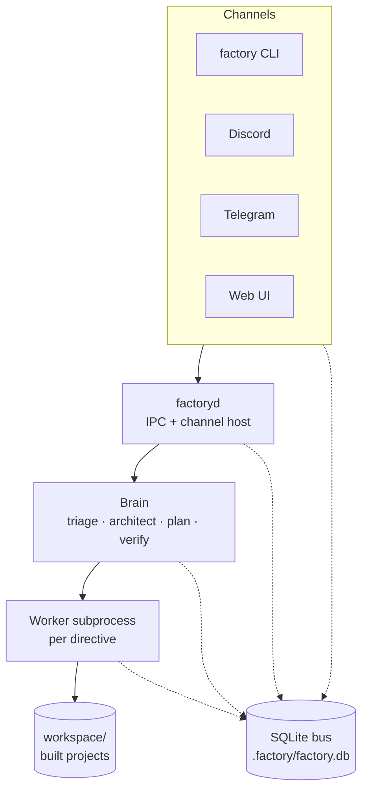
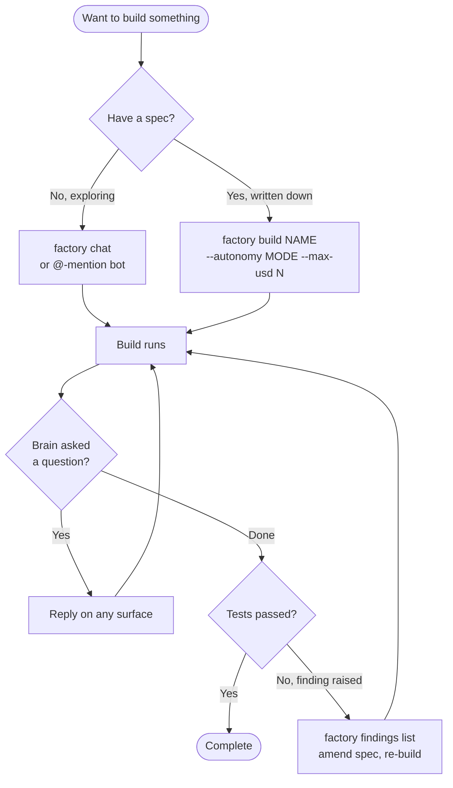

# Factory 5

Autonomous (and human-directable) software builder. Drop a spec, get a project. Talk to the factory in chat or kick off an inline build from the CLI — same brain, multiple channels.

Factory 5 is two processes — a `factory` CLI and a long-lived `factoryd` daemon — that share a SQLite database. Channels (CLI / Discord / Telegram / web UI) write directives onto the bus; the brain (triage → architect → plan → verify) picks them up and spawns a sandboxed worker subprocess per directive. A ground-truth assessor runs your project's real test command (`pytest`, `pnpm test`, `go test`, `cargo test`) so agents can't claim false progress.



Solid arrows = command flow. Dotted = state on the SQLite bus. The CLI can also run **inline** (no daemon) — it writes the directive directly and runs the brain in-process for one-shot scripted builds.

See [`docs/ARCHITECTURE.md`](docs/ARCHITECTURE.md) for the full design.

## Workflows

Four canonical operator loops, picked per task:

- **One-shot build** — write a spec to `CLAUDE.md` in the target directory, then `factory build <name> --autonomy autonomous --max-usd 5`. Best when the spec is already nailed down.
- **Chat-driven exploration** — `factory chat` and converse until you say `/build <name>`. Best when you're still figuring out what you want.
- **Iterative fix** — `factory findings list` / `show`, amend `CLAUDE.md`, re-build with `--autonomy assisted`. Best when the assessor surfaced a regression.
- **Resume after pause** — the brain raises a question mid-run, you answer from any surface (`factory answer`, in-thread Discord/Telegram reply, web form), the build picks back up.



The brain is channel-agnostic — start a build on the CLI, answer the mid-flight escalation from your phone via Telegram, watch spend climb in the web UI. See [`docs/WORKFLOWS.md`](docs/WORKFLOWS.md) for worked examples and the surface-decision matrix.

## Quick start

Prerequisites: **Node 20+**, **pnpm 9+**, **git**, **[Claude CLI](https://claude.com/claude-code)** (`claude --version` should work, authenticated). Optional: **Python 3.11+** if factory will build Python projects.

```bash
git clone <repo-url> factory5
cd factory5

pnpm install
pnpm build
pnpm test                                  # optional sanity check

mkdir .factory                             # instance directory (gitignored)
cp config.example.toml .factory/config.toml

# Edit .factory/config.toml: at minimum, set [general].workspace
# (an empty directory outside the repo where projects will land).
# Channel sections (Discord / Telegram) are optional — skip to start.

pnpm factory doctor                        # health check — must be all-green
pnpm factory build hello-cli --autonomy assisted --max-usd 3
```

That's it — `hello-cli` lands at `<workspace>/hello-cli/`, and `pnpm factory spend` shows where the budget went.

To put `factory` and `factoryd` on `$PATH` (drop the `pnpm` prefix), use the web dashboard, or set up Discord / Telegram, follow [`docs/ONBOARDING.md`](docs/ONBOARDING.md) — it's the long-form clone-to-first-build walkthrough including troubleshooting.

### Windows operator tips

PowerShell defaults to a legacy code page and renders the em-dashes (`—`) in factory's logs as `â€"`. Set the console to UTF-8 once per session (or in `$PROFILE`):

```powershell
[Console]::OutputEncoding = [System.Text.Encoding]::UTF8
```

Windows Terminal + PowerShell 7+ usually handle this automatically; classic PowerShell 5.1 does not.

## Surfaces & permutations

| Surface                   | Best for                                                          | Notes                                      |
| ------------------------- | ----------------------------------------------------------------- | ------------------------------------------ |
| `factory build` (CLI)     | Scripted / batched work, known specs, CI                          | `--inline` bypasses the daemon             |
| `factory chat` (CLI REPL) | Iterative spec authoring, fast turnaround                         | 120 s per-turn ceiling                     |
| Discord                   | Multi-operator teams, threads as conversation history, mobile     | One thread per directive                   |
| Telegram                  | Solo-on-mobile, fastest notifications, low-friction status checks | Reply-to-message answers pending questions |
| Web UI (`/app/`)          | Discoverability, budget editing, visual answer flow               | Read-once today; live SSE updates deferred |

**Three autonomy modes:** `chat` (turn-by-turn), `assisted` (default — autonomous between checkpoints), `autonomous` (full self-drive with mid-flight escalation when stuck).

**Four runtimes:** Python · Node · Go · Rust — selected per directive (`--language` or in the project's `CLAUDE.md` metadata).

**Five providers, routed per agent role:** Claude Code subscription (primary) · Claude API · Codex · OpenRouter · OpenAI. Per-category routing per [ADR 0004](docs/decisions/0004-category-based-model-routing.md); pre-call budget enforcement per [ADR 0020](docs/decisions/0020-pre-call-budget-enforcement.md).

**Two storage modes:** single-instance (`.factory/` lives in the repo, the default) or multiple parallel instances (each at its own path; `cd` selects which one is active — see [ADR 0023](docs/decisions/0023-repo-local-instance-and-cwd-walk.md) and [`docs/ONBOARDING.md`](docs/ONBOARDING.md) §9).

## Layout

```
factory5/
├── CLAUDE.md            ← guidance for Claude Code working on factory5 itself
├── packages/            ← libraries (core, state, ipc, logger, brain, …)
├── apps/                ← runnable binaries (factory, factoryd, factory-web)
├── prompts/             ← agent system prompts (markdown)
├── skills/              ← skill methodology files
├── templates/           ← project templates
├── migrations/          ← SQLite schema
└── docs/                ← architecture, ADRs, contracts, workflows
```

## Documentation

- [`docs/ONBOARDING.md`](docs/ONBOARDING.md) — clone-to-first-build walkthrough, channel setup, web dashboard, multi-instance, troubleshooting
- [`docs/WORKFLOWS.md`](docs/WORKFLOWS.md) — the four operator loops, surface decision matrix, `CLAUDE.md` authoring guide
- [`docs/ARCHITECTURE.md`](docs/ARCHITECTURE.md) — system design
- [`docs/CONTRACTS.md`](docs/CONTRACTS.md) — data contracts (`Directive`, `Finding`, `OutboundMessage`, …)
- [`docs/AGENTS.md`](docs/AGENTS.md), [`docs/SKILLS.md`](docs/SKILLS.md) — agent role + skill catalogs
- [`docs/decisions/`](docs/decisions) — Architecture Decision Records (the _why_)
- [`packages/cli/README.md`](packages/cli/README.md) — full CLI surface, every command, every flag, every exit code

## Contributing / working on factory5

Every working session reads [`CLAUDE.md`](CLAUDE.md) first — it's the standing brief. The repo follows the same discipline factory imposes on its outputs: design before code, verification-first, ADRs in `docs/decisions/`, finding lifecycle.

## License

MIT
