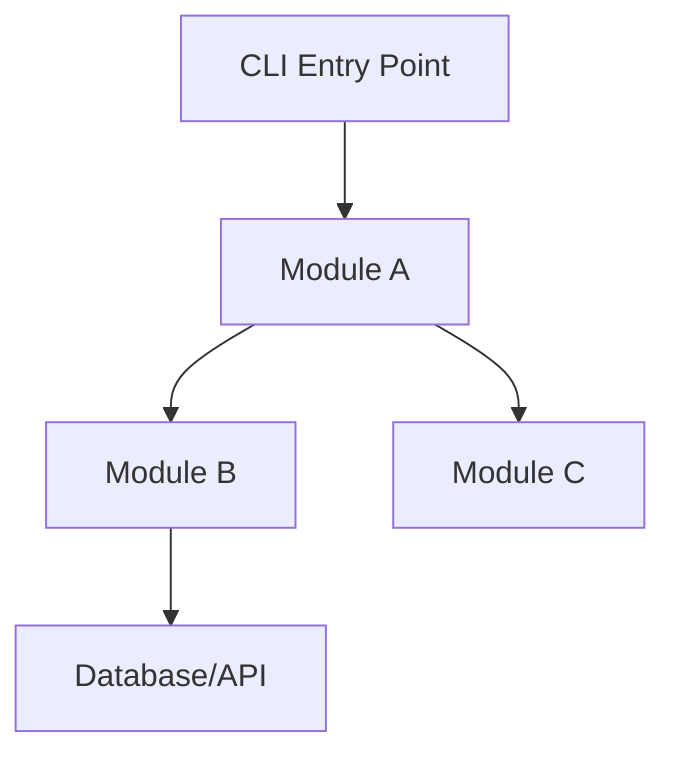
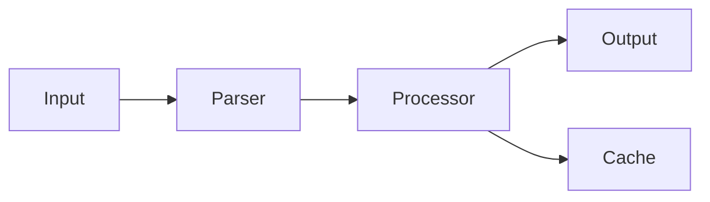
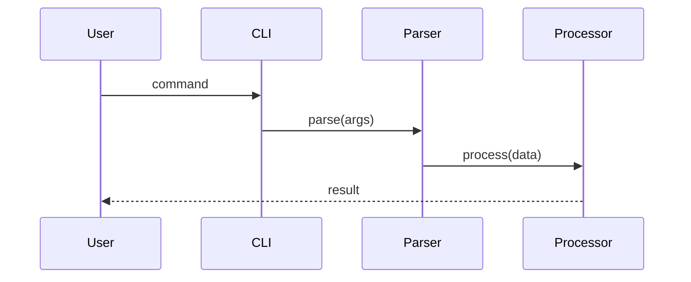

# Documentation Generation

Every shipped project MUST have complete documentation in a `docs/` folder
plus a detailed root `README.md`.

## Required Deliverables

### 1. Root README.md (detailed)

Must include ALL of these sections:

- **Project title and badge area** (build status placeholder, license badge)
- **Overview** — 2-3 paragraph description of what it does and why
- **Features** — bullet list of key capabilities
- **Architecture** — brief overview with link to docs/architecture.md
- **Quick Start** — copy-paste commands to get running in under 2 minutes
- **Installation** — detailed setup (link to docs/setup.md for advanced)
- **Usage** — code examples showing primary use cases
- **API Reference** — if applicable, document public functions/endpoints
- **Testing** — how to run tests, expected output
- **Project Structure** — tree view of key files and what they do
- **Contributing** — brief guide
- **License** — MIT

### 2. docs/architecture.md

Document the system architecture with **mermaid diagrams**:

````markdown
# Architecture

## System Overview

Brief description of the overall design.

## Component Diagram


````

## Data Flow



## Module Details

For each module:

- Purpose
- Key functions and their signatures
- Dependencies
- Data types defined

## Sequence Diagram (for key operations)



````

Use at least 2 mermaid diagrams (component + data flow minimum).

### 3. docs/setup.md

Detailed setup guide covering:
- **Prerequisites** — Python/Node version, system dependencies
- **Installation steps** — clone, install deps, configure
- **Environment variables** — every env var with description and example
- **Configuration** — config files, where they live, what options exist
- **Database setup** — if applicable
- **Verification** — "run this command to verify setup works"
- **Troubleshooting** — common setup problems and fixes
- **Development setup** — additional steps for contributors (linting, pre-commit, etc.)

### 4. docs/notebooks/ (Jupyter notebooks)

Create notebooks that demonstrate the project's components:

**Required notebooks:**
- `01_getting_started.ipynb` — Import the project, basic usage example
- `02_core_features.ipynb` — Demonstrate each major feature/module
- Additional notebooks as needed for complex features

**Each notebook must have:**
- Title cell (markdown) with description
- Import and setup cells
- Demonstration cells with explanatory markdown between them
- Each code cell should be tested and produce visible output
- Error handling examples where relevant

**Notebook structure:**
```python
# Cell 1: Markdown - Title and overview
# Cell 2: Code - Imports and setup
# Cell 3: Markdown - Explain what comes next
# Cell 4: Code - Demo with output
# ... repeat pattern
# Final cell: Markdown - Summary and next steps
````

For Python projects, create `.ipynb` files directly.
For TypeScript projects, create `.ts` demo scripts in docs/examples/ instead.

## Rules

- Every mermaid diagram must render correctly (valid mermaid syntax)
- Every notebook cell must be tested — run them before committing
- README must be self-sufficient — a new user should understand the project from README alone
- setup.md must be copy-paste-able — every command should work as written
- Use relative links between docs: `[Architecture](docs/architecture.md)`
